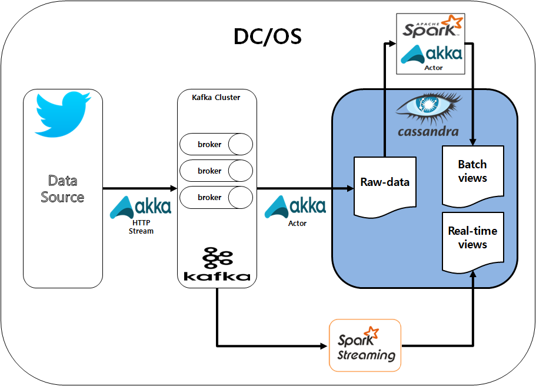

# NexCloud SMACK Stack Sample

* 데이터 소 스 : 트위터
* 브로커 : Kafka ( Kafka topic : tweet_spark )
* 데이터 저장소 : cassandra
* 실시간 스트리밍 변환 : Spark
* 프로세실행 : Akka {Actor, AkkaHttpStreaming}

----------------------------------------------------------------------------------------------------
### Twitter -> Akka HTTP with Streaming -> Kafka ( Raw Data 수집 )
----------------------------------------------------------------------------------------------------
1) Twitter에서 제공한 API로 Event Listner등록
2) Event발생시 마다 Akka Http Streaming API를 사용하여 Kafka 저장
3) [DC/OS Service Json](https://github.com/mashine3189/Nexcloud-Smack/blob/master/json/twitter-to-kafka.json)

----------------------------------------------------------------------------------------------------
### Kafka -> Akka with Actor -> Cassandra ( Raw Data 저장 )
----------------------------------------------------------------------------------------------------
1) Akka Actor를 이용하여 프로세스 실행
2) 1초마다 Loop를 돌아 Kafka 데이터 체크
3) Insert json into Cassandra
4) [DC/OS Service Json](https://github.com/mashine3189/Nexcloud-Smack/blob/master/json/kafka-to-cassandra.json)

----------------------------------------------------------------------------------------------------
### Kafka -> Spark with Streamig -> Cassandra ( 가공 Realtime Data )
----------------------------------------------------------------------------------------------------
1) DCOS spark 명령으로 프로세스 실행
2) Spark Streaming으로 데이터 유실없는 실시간 가공데이터 저장( Cassandra )
3) [실행 Spark Shell](https://github.com/mashine3189/Nexcloud-Smack/blob/master/shell/kafka_sparkstreaming_cassandra.sh.sh)

----------------------------------------------------------------------------------------------------
### Cassandra( raw data ) -> Spark sql(RDD) -> Cassandra ( 가공 Batch Data )
----------------------------------------------------------------------------------------------------
1) Akka Actor로 프로세스 실행
2) Spark Sql(RDD)를 이용한 raw data가공
3) 가공데이터 batch table에 저장
4) [실행 Spark Shell](https://github.com/mashine3189/Nexcloud-Smack/blob/master/shell/kafka_batch_cassandra.sh.sh)
